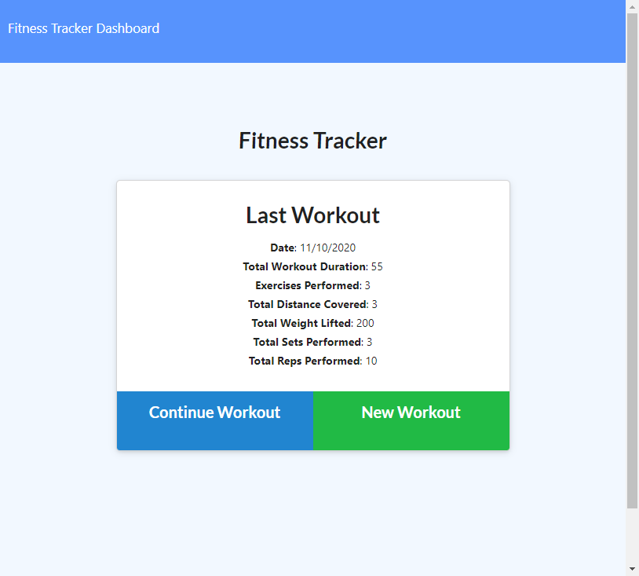
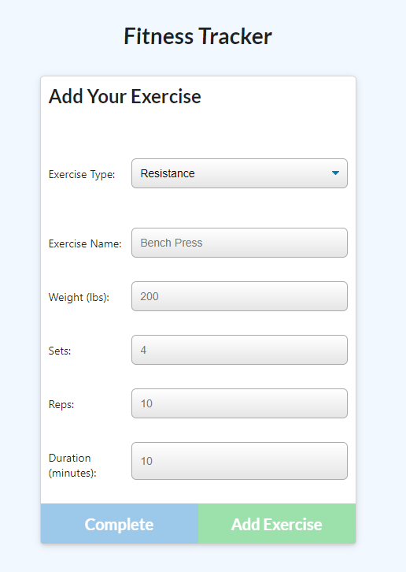
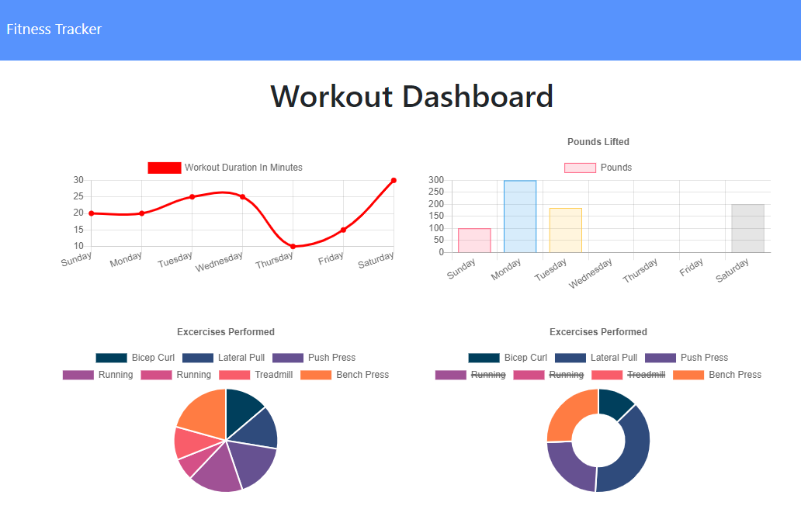

# Fitness Tracker
[](https://opensource.org/licenses/MIT)

## Description
This is a fitness tracker web app using node, express, mongodb, and mongoose. A user is able to create a new workout and add exercises to their workout. The user can then view their stats based on workout duration and weight.

## Table of contents
* [Installation](#installation)
* [License](#license)
* [Screenshots](#screenshots)
* [Questions](#questions)
        
## Installation
To install necessary dependencies, run the following command:
```
npm i
```

## License 
This project is licensed under the MIT license.

## Screenshots
The initial screens will show the user their last workout.

The user is able to add exercises to their workout.

The user can look at the stats on this dashboard page.


## Questions
If you have any questions about this repository, open an issue or contact me directly at megtej@gmail.com. You can find more of my work at [mslee001](https://github.com/mslee001).